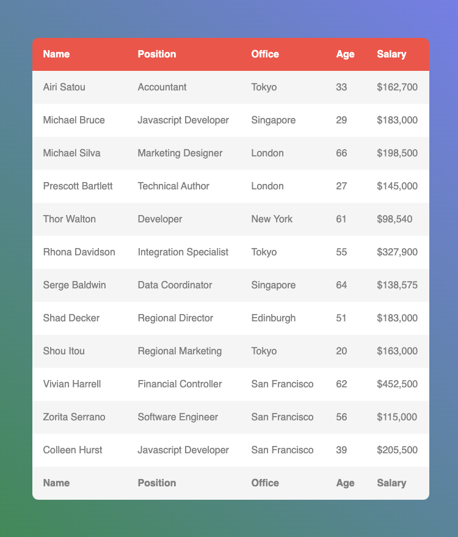
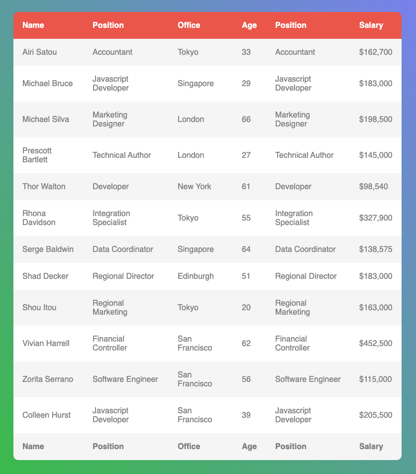

1. Replace `<your_account>` with your Github username in the link
    - [DEMO LINK](https://ztx25.github.io/js_task_clone_table_column_DOM/)
2. Follow [this instructions](https://mate-academy.github.io/layout_task-guideline/)
    - Run `npm run test` command to test your code;
    - Run `npm run test:only -- -n` to run fast test ignoring linter;
    - Run `npm run test:only -- -l` to run fast test with additional info in console ignoring linter.

### Task: Copy/Paste table column

Clone and paste element to document... Easy? Okay, but what do you say when I aks you to clone and paste table column? This task is for real heroes!

Your task: Clone the second column from the table, and append it to the table. To increase the complexity, append it in front of the last table column.

Initial table:

Expected table:

In this task, we don't provide details instructions. But below are some hints how to do this task:
- JavaScript document has methods to work with tables. [Theory tables](https://javascript.info/dom-navigation#dom-navigation-tables) 
- Before you start review the table structure
- Remember that in this task HTML table has `tbody`, `thead`, `tfoot` sections.
- As a first step try to append first column to the end of the table.

You don't need to change styles or HTML layout in this task. Change only `main.js` file.
